# 🛡️ VoiceShield — Complete Backend Logic & Architecture Guide

> **Statutory Notice**: VoiceShield is an advisory decision-support prototype. It does not execute automatic enforcement, call disconnection, or biometric identity verification.

---

## 📑 Table of Contents
1. [System Overview & Tech Stack](#1-system-overview--tech-stack)
2. [High-Level Architecture & Dataflow Diagram](#2-high-level-architecture--dataflow-diagram)
3. [Module-by-Module Code Structure](#3-module-by-module-code-structure)
4. [Step-by-Step Processing Pipeline](#4-step-by-step-processing-pipeline)
   - [Phase 1: Ingestion & Boundary Validation](#phase-1-ingestion--boundary-validation)
   - [Phase 2: Privacy & In-Memory Audio I/O](#phase-2-privacy--in-memory-audio-io)
   - [Phase 3: Preprocessing & Signal Diagnostics](#phase-3-preprocessing--signal-diagnostics)
   - [Phase 4: 42-D Acoustic Feature Extraction Engine](#phase-4-42-d-acoustic-feature-extraction-engine)
   - [Phase 5: Dual-Inference Engine & Sliding-Window Ensemble](#phase-5-dual-inference-engine--sliding-window-ensemble)
   - [Phase 6: Probability Calibration & 5-State Risk Engine](#phase-6-probability-calibration--5-state-risk-engine)
   - [Phase 7: Explainability (XAI) & Anomaly Attribution](#phase-7-explainability-xai--anomaly-attribution)
   - [Phase 8: Real-Time Stream Engine (Live Calls)](#phase-8-real-time-stream-engine-live-calls)
5. [Key Mathematical Formulas & Algorithms](#5-key-mathematical-formulas--algorithms)
6. [API Specification & Data Contracts](#6-api-specification--data-contracts)
7. [Defensive Security & Privacy Guarantees](#7-defensive-security--privacy-guarantees)

---

## 1. System Overview & Tech Stack

VoiceShield backend ek production-ready, low-latency, privacy-preserving audio intelligence engine hai jo synthetic voice (TTS, Voice Conversion, Deepfake) detect karta hai.

### Core Stack:
* **Web & API Framework:** FastAPI (REST API), Streamlit (SOC Analyst UI)
* **Audio Processing:** Librosa, SoundFile, PyDub, SciPy, NumPy
* **Machine Learning:** Scikit-Learn (Calibrated Random Forest / ExtraTrees), Joblib
* **Data Validation:** Pydantic v2
* **Containerization & Deployment:** Docker, Uvicorn (ASGI), PowerShell/Bash automation

---

## 2. High-Level Architecture & Dataflow Diagram

```mermaid
flowchart TD
    subgraph ClientLayer ["1. Client / Input Layer"]
        A1["Uploaded File (WAV/MP3/M4A/FLAC/OGG)"]
        A2["Live Call Streaming Audio (160ms Chunks)"]
    end

    subgraph SecurityLayer ["2. Security & Privacy Layer"]
        B1["MIME & Filename Sanitizer (api.py)"]
        B2["In-Memory Ephemeral Buffer (src/privacy.py)"]
        B3["Boundary & Corruption Validator (src/validation.py)"]
    end

    subgraph DSPProcessing ["3. DSP & Feature Engine"]
        C1["Standard Resampling (16 kHz Mono)"]
        C2["VAD & Silence Trimmer (src/preprocessing.py)"]
        C3["Signal Diagnostics: SNR, RMS, Clipping"]
        C4["42-D Forensic Acoustic Feature Extraction (src/features.py)"]
    end

    subgraph MLEnsemble ["4. Dual-Path ML Scoring Engine"]
        D1["Global Inference (Whole Audio Vector 1x42)"]
        D2["Sliding Window Inference (2.5s Window / 1.0s Hop)"]
        D3["Dynamic Weighted Ensemble Voting (src/scoring.py)"]
        D4["Isotonic / Platt Probability Calibration (src/calibration.py)"]
    end

    subgraph ExplainabilityLayer ["5. Explainability & Output"]
        E1["5-State Risk Band & Actionable Advisory"]
        E2["Feature Anomaly Attribution & Radar Diagnostics (src/explainability.py)"]
        E3["Pydantic JSON Response / SOC Dashboard"]
    end

    ClientLayer --> SecurityLayer
    SecurityLayer --> DSPProcessing
    DSPProcessing --> MLEnsemble
    MLEnsemble --> ExplainabilityLayer
```



---

## 3. Module-by-Module Code Structure

| Directory / File | Core Responsibility |
| :--- | :--- |
| `api.py` | FastAPI REST service, CORS, error handling, endpoints (`/health`, `/metadata`, `/predict`). |
| `app.py` | Streamlit SOC security dashboard with audio visualizers & analyst reports. |
| `src/config.py` | Global constants (Sample Rate: 16kHz, Thresholds, Supported Extensions, File Size Limit: 25MB). |
| `src/privacy.py` | Zero-disk persistence audit, in-memory pointer zeroing & byte scrubbing. |
| `src/audio_io.py` | Resilient audio decoding via BytesIO, fallback format parsers. |
| `src/validation.py` | Pre-inference guardrails (duration > 0.5s, non-empty, silent check). |
| `src/preprocessing.py` | Mono conversion, 16kHz resampling, top-dB VAD trim, SNR & clipping calculation. |
| `src/features.py` | Hand-crafted 42-D acoustic and spectral feature extraction. |
| `src/model.py` | Pipeline serialization, model loader, metadata schema checker. |
| `src/scoring.py` | Dual global-segment inference, dynamic weighted ensemble, thresholding. |
| `src/calibration.py` | Probability calibration, 5-state risk band classifier (`low`, `review`, `high`, `uncertain`, `low_quality`). |
| `src/explainability.py` | Anomaly attribution, pitch/spectral radar metrics, OOD detection. |
| `src/streaming.py` | Circular buffer for low-latency live chunk processing. |
| `src/schemas.py` | Strict Pydantic models for request/response serialization. |

---

## 4. Step-by-Step Processing Pipeline

### Phase 1: Ingestion & Boundary Validation
1. **Filename Sanitization:** Filename me se path traversal (`../`) aur invalid characters regex se block kiye jaate hain.
2. **Format Whitelisting:** Sirf supported extensions allow hoti hain (`.wav`, `.mp3`, `.m4a`, `.mp4`, `.ogg`, `.flac`).
3. **Payload Limit:** File size check hota hai ($0 < \text{size} \le 25\text{MB}$). Agar size bahar ho to `HTTP 413` return hota hai.

### Phase 2: Privacy & In-Memory Audio I/O
1. **Zero-Disk Guarantee:** File bytes ko memory stream (`io.BytesIO`) me read kiya jata hai. Disk par koi temp file create nahi hoti.
2. **Resilient Decoding:** `soundfile` primary decoder hota hai, agar header missing ho to `pydub` fallback use hota hai.

### Phase 3: Preprocessing & Signal Diagnostics
1. **Channel Mixing:** Stereo ya multi-channel audio ko averaging formula $x_{\text{mono}} = \frac{1}{C}\sum_{c=1}^C x_c$ se convert kiya jata hai.
2. **Resampling:** Target sampling rate **16,000 Hz** fix rehti hai taaki nyquist frequency ($8\text{kHz}$) baseline uniform rahe.
3. **VAD (Voice Activity Detection):** Dead air/silence ko `librosa.effects.trim(top_db=25)` se trim kiya jata hai.
4. **Signal Diagnostics:**
   - **SNR (Signal-to-Noise Ratio):** Speech energy vs background noise floor ka ratio compute hota hai.
   - **Clipping Rate:** $\text{Samples} \ge 0.99$ ya $\le -0.99$ count karke distortion percentage detect hoti hai.

### Phase 4: 42-D Acoustic Feature Extraction Engine
Model synthetic voice ke subtle vocoder artifacts ko detect karne ke liye 42 features nikalta hai:

| Feature Group | Count | Details |
| :--- | :---: | :--- |
| **MFCC Means (1–13)** | 13 | Mel-frequency cepstral coefficients ke average values. Vocal tract characteristics capture karta hai. |
| **MFCC Std Deviations (1–13)** | 13 | Phoneme-level spectral variation aur natural voice dynamics. |
| **Delta MFCC Means (1–2)** | 2 | 1st & 2nd order frame-to-frame velocity transitions. |
| **Delta MFCC Stds (1–2)** | 2 | Dynamic acceleration variance (synthetic speech me overly smooth hoti hai). |
| **Spectral Centroid (Mean & Std)** | 2 | Audio ke "brightness" aur frequency distribution ka center. |
| **Spectral Bandwidth (Mean & Std)** | 2 | Frequency spread width around centroid. |
| **Spectral Rolloff (Mean & Std)** | 2 | High-frequency cutoff point ($85\%$ spectral energy threshold). |
| **Spectral Flatness (Mean & Std)** | 2 | Tone vs noise ratio. Vocoder hiss ya unnatural tonal flatness detect karta hai. |
| **RMS Energy (Mean & Std)** | 2 | Amplitude dynamics aur speech volume modulation. |
| **Zero Crossing Rate (ZCR Mean & Std)** | 2 | Unvoiced friction sounds aur high-frequency noise transitions. |
| **Total Features** | **42** | Complete numeric representation vector $(1 \times 42)$. |

### Phase 5: Dual-Inference Engine & Sliding-Window Ensemble
Single global vector se poori audio evaluate karne ke alawa sliding window voting use hoti hai:
1. **Global Prediction:** Whole-audio 42-D vector model me pass hoke $P_{\text{global}}$ deta hai.
2. **Segmented Windows:** Audio ko $2.5\text{s}$ duration ke chunks ($1.0\text{s}$ overlap) me divide kiya jata hai.
3. **Median Voting Calculation:**
   $$\text{Median Spoof} = \text{median}\Big(\big[P_1, P_2, \dots, P_N\big]\Big)$$
4. **Adaptive Blending Formula:**
   $$\text{Raw Spoof} = \begin{cases} 0.80 \cdot P_{\text{global}} + 0.20 \cdot \text{Median Spoof}, & \text{if } P_{\text{global}} < 0.25 \\ 0.65 \cdot P_{\text{global}} + 0.35 \cdot \text{Median Spoof}, & \text{if } P_{\text{global}} \ge 0.25 \end{cases}$$

### Phase 6: Probability Calibration & 5-State Risk Engine
Machine learning model raw outputs ko calibrate karke standard **0–100 Risk Score** banaya jata hai:
$$\text{Risk Score} = \text{clip}\big(\text{round}(P_{\text{calibrated}} \times 100), 0, 100\big)$$

#### 5-State Risk Hierarchy:
1. **🟢 Low Risk (0–24):** Genuine human voice. Standard processing.
2. **🟡 Moderate / Review Required (25–49):** Borderline anomalies. Step-up multi-factor authentication (MFA) recommended.
3. **🟠 Elevated Risk (50–74):** Significant synthetic indicators detected. Mandatory supervisor review.
4. **🔴 High Risk (75–100):** High-confidence voice clone/deepfake. Flag transaction/interaction for immediate fraud review.
5. **⚪ Uncertain / Low Quality:** Insufficient SNR ($< 10\text{dB}$) ya clipped audio. Re-recording requested.

### Phase 7: Explainability (XAI) & Anomaly Attribution
Backend prediction ke peeche ka solid reason provide karta hai:
- **Radar Metrics:** Pitch naturalness, spectral continuity, phase coherence, aur energy stability ka $0.0-1.0$ score.
- **Top Forensic Anomaly Cues:** Textual explanations (e.g., *"Unnatural spectral flatness indicates neural vocoder synthesis"*).
- **Out-of-Distribution (OOD) Guard:** Feature values agar training distribution se $> 3.5\sigma$ door hon to uncertainty flag raise karta hai.

### Phase 8: Real-Time Stream Engine (Live Calls)
* `src/streaming.py` me circular rolling buffer implement hai:
  - Small raw chunks ($160\text{ms}$ to $500\text{ms}$) receive hote hain.
  - Buffer dynamically last $3.0\text{s}$ ka speech context retain karta hai.
  - Har new frame par inference latency **$< 25\text{ms}$** rehti hai, jo live telephony systems ke liye fully compatible hai.

---

## 5. Key Mathematical Formulas & Algorithms

### 1. Signal-to-Noise Ratio (SNR) Estimation:
$$\text{SNR}_{\text{dB}} = 10 \log_{10} \left( \frac{P_{\text{signal}}}{P_{\text{noise}}} \right) = 10 \log_{10} \left( \frac{\frac{1}{N_{\text{speech}}}\sum |x_{\text{speech}}|^2}{\frac{1}{N_{\text{silence}}}\sum |x_{\text{silence}}|^2} \right)$$

### 2. Spectral Flatness:
$$\text{Flatness} = \frac{\exp\left(\frac{1}{K}\sum_{k=1}^K \ln |X(k)|^2\right)}{\frac{1}{K}\sum_{k=1}^K |X(k)|^2}$$
*(Geometric mean / Arithmetic mean. Pure tones have Flatness $\to 0$, White noise / Vocoder hiss $\to 1$.)*

### 3. Out-Of-Distribution (OOD) Z-Score Distance:
$$Z_i = \frac{|f_i - \mu_i|}{\sigma_i}, \quad \text{OOD Flag} = \mathbb{I}\left( \max_i(Z_i) > 3.5 \right)$$

---

## 6. API Specification & Data Contracts

### Endpoint: `POST /predict`
* **Request:** `multipart/form-data` with `file: UploadFile`
* **Response:**
```json
{
  "prediction": "spoof",
  "risk_score": 88,
  "risk_band": "High risk",
  "confidence": 0.924,
  "probabilities": {
    "bona_fide": 0.076,
    "spoof": 0.924
  },
  "diagnostics": {
    "sample_rate": 16000,
    "duration_seconds": 3.84,
    "snr_db": 26.5,
    "clipping_percentage": 0.0,
    "quality_flag": "acceptable"
  },
  "explainability": {
    "top_anomalies": [
      "Unnatural spectral flatness indicates vocoder synthesis",
      "Low pitch micro-variance detected"
    ],
    "radar_metrics": {
      "pitch_naturalness": 0.18,
      "spectral_consistency": 0.22,
      "phase_coherence": 0.29,
      "energy_stability": 0.85
    }
  },
  "statutory_notice": "Experimental decision-support prototype; not identity proof. Must not be used for automatic call termination or transaction blocking."
}
```

---

## 7. Defensive Security & Privacy Guarantees

1. **In-Memory Volatility:** Audio payload RAM me deserialize hota hai aur garbage collect hone ke baad memory scrub hoti hai. Zero persistence to disk.
2. **DoS Protection:** Max buffer size 25MB restricted hai, and maximum processed audio window 30s cap hai.
3. **No Automatic Enforcement:** Statutory disclaimer strictly prohibit karta hai autonomous transaction blocking ya call dropping without human-in-the-loop review.

---
