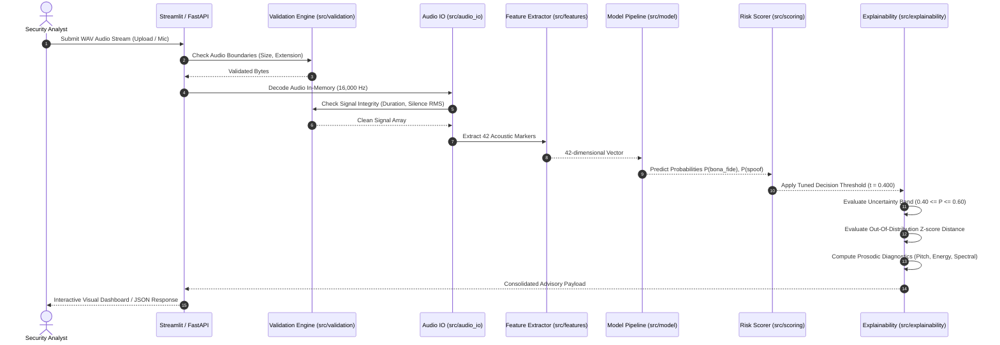

# 🏛️ VoiceShield System Architecture

> **Notice**: *VoiceShield is an advisory decision-support prototype. It does not execute automatic enforcement or biometric identity verification.*

---

## 1. Modular Layer Architecture

VoiceShield follows a clean, decoupled, layered software architecture designed for extensibility, local reproducibility, and testability.

```
voice-clone-detector/
├── src/
│   ├── config.py           # Central configuration, paths, thresholds, and statutory disclaimers
│   ├── audio_io.py         # Resilient audio loading, metadata extraction & format normalization
│   ├── validation.py       # Signal validation (duration, file size, silence & corruption boundaries)
│   ├── features.py         # 42-element acoustic feature extraction (MFCC Means/Stds, RMS, ZCR)
│   ├── model.py            # StandardScaler + RandomForest Pipeline builder, serialization & loader
│   ├── scoring.py          # Calibrated risk scoring (0-100), risk bands & analyst recommendations
│   ├── explainability.py   # Signal diagnostics, uncertainty checking, OOD detection & feature groups
│   └── privacy.py          # In-memory ephemeral processing & privacy audit guarantees
├── scripts/
│   ├── build_manifest.py   # Dataset manifest generation with SHA-256 integrity verification
│   ├── check_dataset.py    # Dataset quality auditor (detects corruption, duplicates, leakage)
│   ├── train_model.py      # Reproducible baseline training with hyperparameter grid search
│   ├── evaluate_model.py   # Independent test partition evaluation & confusion matrix generator
│   └── simulate_stream.py  # Sandbox chunked audio stream simulator (160ms window / 40ms stride)
├── app.py                  # Streamlit Security Operations Center (SOC) dashboard
├── api.py                  # FastAPI RESTful inference service
└── tests/                  # Pytest automated test suites covering all modules and failure modes
```

---

## 2. Component Interaction & Execution Flow



---

## 3. Key Design Principles
1. **Separation of Concerns**: Feature extraction (`src/features.py`), model inference (`src/model.py`), and operational risk mapping (`src/scoring.py`) operate independently.
2. **Deterministic Reproducibility**: All random seeds (`random_state=42`) and dataset hashes (SHA-256) are logged and verified during build.
3. **Fail-Safe Defensive Programming**: Boundary checks catch silent, corrupt, or short audio before ML inference, returning structured advisory errors.
4. **Privacy by Design**: Raw audio is handled exclusively in volatile memory; zero temporary audio files are stored or cached on disk.
