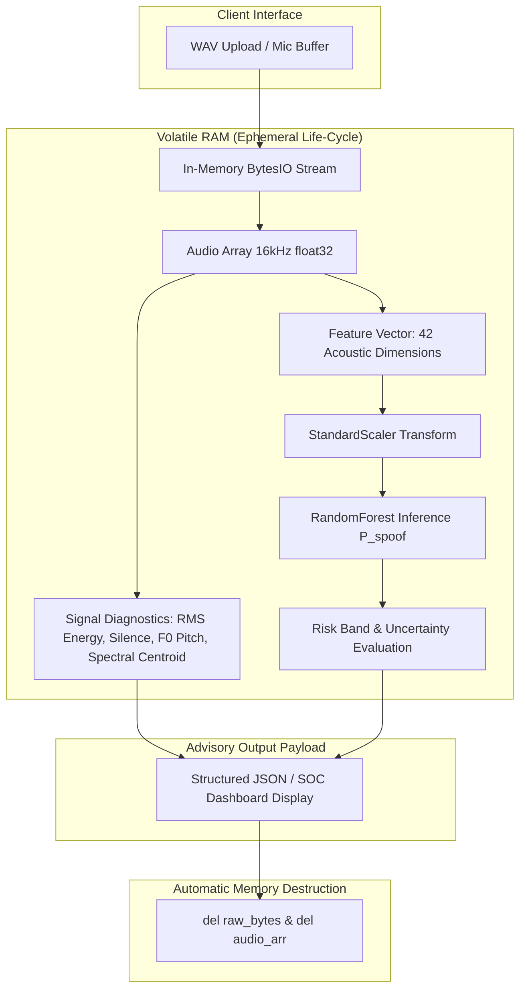

# 🔄 VoiceShield Data Flow & Memory Lifecycle

> **Privacy Notice**: *VoiceShield executes strictly in-memory audio processing. No raw audio recordings are permanently stored or transmitted across network boundaries.*

---

## 1. Ephemeral In-Memory Data Flow

---

## 2. Audio Processing Lifecycle Stages

### Stage 1: Ingestion & Boundary Validation
- Audio data is received as a binary stream in volatile memory.
- File size is checked against `MAX_FILE_SIZE_BYTES` (15 MB limit).
- Non-WAV file formats are rejected before decoding.

### Stage 2: Signal Decoding & Resampling
- `soundfile.read` decodes audio in RAM into a 1D NumPy `float32` array.
- Stereo channels are downmixed to mono via channel averaging.
- Audio is resampled to `SAMPLE_RATE` (16,000 Hz) to ensure acoustic consistency.

### Stage 3: Feature Extraction (42 Features)
- **20 MFCC Means**: Measures spectral vocal tract envelope shape.
- **20 MFCC Standard Deviations**: Measures temporal frequency modulation across frames.
- **1 RMS Energy Mean**: Measures overall signal power.
- **1 Zero Crossing Rate Mean**: Measures noise floor and unvoiced fricative transition rates.

### Stage 4: Risk Scoring & Explainability
- Feature vector is standardized using training parameters stored in the Pipeline.
- Random Forest outputs probability $P(\text{spoof}) \in [0.0, 1.0]$.
- Tuned threshold ($t = 0.400$) is applied.
- If $0.40 \le P \le 0.60$, uncertainty banner (`UNCERTAIN — MANUAL REVIEW REQUIRED`) is triggered.

### Stage 5: Ephemeral Destruction
- Python `del` statements and garbage collection release audio buffers from memory.
- `audio_saved: false` is returned in all metadata payloads.
