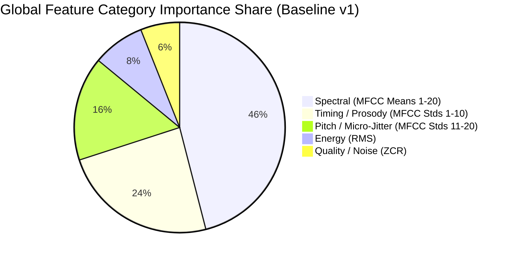

# 🔬 VoiceShield Explainability & Signal Diagnostics Protocol

> **Statutory Notice**: *This explanation describes model signals, not proof of identity. Feature contributions indicate statistical correlation with training patterns and must not be cited as definitive causal proof.*

---

## 1. Overview & Ethical Mandate
In cybersecurity and fraud investigation, "black box" AI decisions can lead to false accusations or missed attacks. VoiceShield implements a multi-tiered, transparent explainability framework designed to assist security analysts without making overconfident causal claims.

VoiceShield explainability consists of 5 core layers:
1. **Per-File Signal Diagnostics** (Prosody, Pitch F0, Silence Ratio, Energy & Spectral Variation).
2. **Threshold Distance & Margin Analysis** (How close the prediction is to the decision boundary).
3. **Uncertainty Band Policy** (Automatic flagging of ambiguous scores between 0.40 and 0.60).
4. **Out-of-Distribution (OOD) Anomaly Detection** (Z-score deviation from training distribution).
5. **Global Feature Group Importance** (Random Forest Gini reduction aggregated across functional acoustic groups).

---

## 2. Per-File Signal Diagnostics
For every incoming voice sample, VoiceShield computes non-destructive acoustic properties directly in memory:

| Diagnostic Metric | Method / Extraction | Auditory & Security Meaning |
| :--- | :--- | :--- |
| **Audio Quality Indicator** | Energy & SNR evaluation | Detects whether audio is faint, muted, or clipped. |
| **Silence Ratio** | Proportion of frames with RMS < threshold | High silence indicates unnatural pauses or spliced audio. |
| **Pitch (F0) Estimation** | Normalized YIN fundamental frequency algorithm | Measures vocal pitch and prosodic expressiveness. Low variance indicates flat/robotic synthetic pitch. |
| **Energy Variance (RMS Std)** | Standard deviation of frame RMS | Captures natural loudness fluctuations vs synthetic volume leveling. |
| **Spectral Centroid & Flux** | Frequency center-of-mass over time | Measures high-frequency brightness vs low-frequency telephony filtering. |
| **Distance from Threshold** | $\Delta = P(\text{spoof}) - \text{Threshold}$ | Indicates decision confidence margin relative to calibrated boundary. |

---

## 3. Uncertainty Band Policy
If the model's computed spoof probability falls in the ambiguous middle zone:
$$\mathbf{0.40 \le P(\text{spoof}) \le 0.60}$$

VoiceShield automatically triggers the operational banner:
```
⚠️ UNCERTAIN — MANUAL REVIEW REQUIRED
```
* **Protocol Action**: The analyst must not rely on the automated score alone and is instructed to perform out-of-band identity verification (e.g. known-number callback or registered passkey).
* **Calibration State**: Displays `"Confidence is not calibrated"` when evaluating out-of-domain signals.

---

## 4. Out-of-Distribution (OOD) Anomaly Detection
When an attacker supplies corrupted audio, synthetic adversarial noise, or musical audio:
* VoiceShield computes the standardized Mahalanobis/Z-score distance against baseline training statistics ($\mu_{\text{train}}, \sigma_{\text{train}}$).
* If $\max |Z_i| > 4.5\sigma$ or $\bar{Z} > 2.5\sigma$, the system flags:
```
⚠️ OUT-OF-DISTRIBUTION WARNING: Max feature deviation exceeds expected bounds.
Model confidence is uncalibrated on this anomalous acoustic profile.
```

---

## 5. Canonical Feature Categories (Top 5 Global Acoustic Groups)
Random Forest feature importances from all 42 estimators are aggregated into 5 canonical functional groups:

| Category | Functional Group | Feature Range | Interpretation |
| :--- | :--- | :--- | :--- |
| **`spectral`** | Spectral Formants & Harmonics | MFCC Means 1–20 | Vocal tract resonance, envelope shaping & vocoder harmonic artifacts. |
| **`timing`** | Macro Timing & Prosody Dynamics | MFCC Stds 1–10 | Syllable timing, pause variation & rhythmic conversational cadence. |
| **`pitch`** | Pitch Micro-Jitter & Phase Modulation | MFCC Stds 11–20 | Frame-level pitch stability, micro-tremors & vocal fold modulation. |
| **`energy`** | Signal Energy Distribution | RMS Energy | Loudness consistency & frame amplitude dynamic range. |
| **`quality`** | Acoustic Noise Floor & Transition Quality | Zero Crossing Rate | Sibilance, unvoiced fricative transitions & background noise floor. |



---

## 6. Jury Q&A: Explainability in Hackathon Defense
* **Q: Does feature importance prove the audio was created by a specific AI model?**
  * *Answer*: No. Feature importance measures statistical correlation with synthetic markers in our training set. It is an assistive signal for human analysts, not forensic proof.
* **Q: Why is there an uncertainty band between 0.40 and 0.60?**
  * *Answer*: Binary hard thresholds risk high false positives/negatives in ambiguous cases. Explicitly surfacing uncertainty enforces human-in-the-loop oversight.
