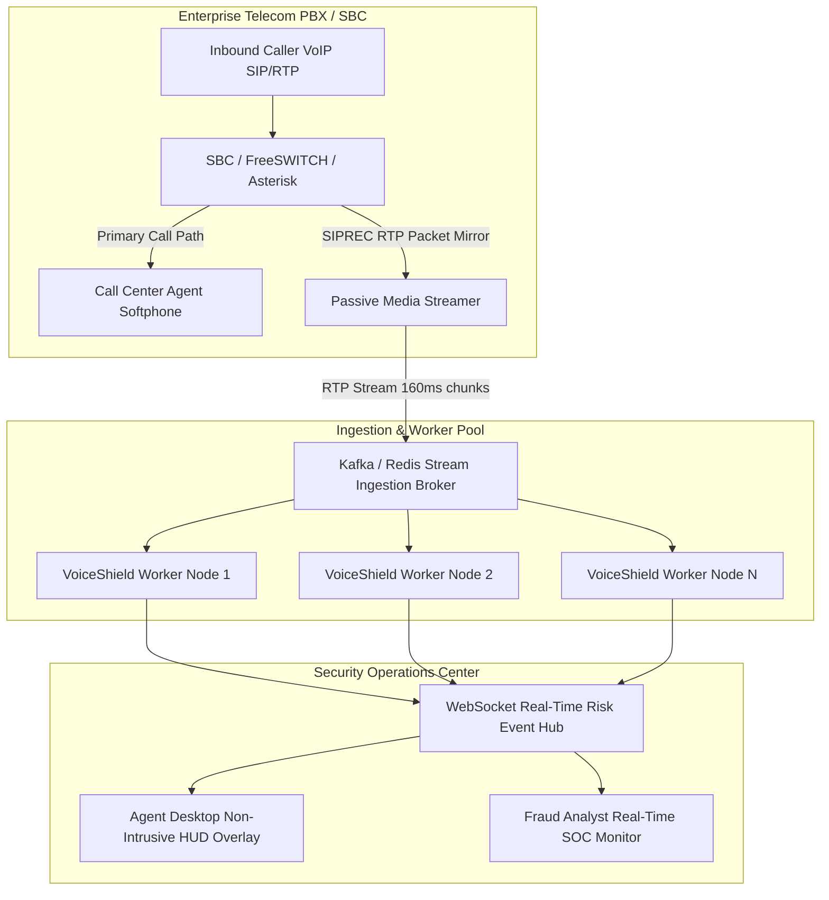

# 📞 Future Live-Call Telephony Scaling Architecture

> **Notice**: *This document outlines the theoretical enterprise scaling architecture for live-call telephony environments. The current VoiceShield prototype operates strictly in a local sandbox.*

---

## 1. Enterprise Live-Call Telephony Architecture

In a production enterprise call center or Security Operations Center (SOC), VoiceShield would operate as a **passive, non-intrusive sidecar** over mirrored RTP streams via standard Session Initiation Protocol Recording (**SIPREC**):

---

## 2. Technical Building Blocks

### 2.1 Passive RTP Mirroring (SIPREC / Packet Sniffing)
- **Zero Inline Latency**: The primary audio path between caller and call center agent is never interrupted or proxied inline.
- **Session Mirroring**: The Session Border Controller (SBC, e.g. AudioCodes, Cisco, or FreeSWITCH) forks the caller RTP stream over SIPREC to an ingestion endpoint.

### 2.2 Distributed Message Ingestion Broker
- **Apache Kafka / Redis Streams**: Manages incoming 160 ms audio frame buffers keyed by `Call-ID` and `Timestamp`.
- **Partitioning**: Dynamic partition assignment ensures all audio chunks from a single call route to the same worker node for stateful Exponential Moving Average (EMA) rolling risk calculation.

### 2.3 Horizontal Worker Scaling
- **Stateless Analysis Workers**: Containerized FastAPI / Celery workers evaluate 42-feature acoustic vectors and signal diagnostics in ~4 ms per window on standard CPU instances.
- **Elastic Auto-Scaling**: Kubernetes Horizontal Pod Autoscaler (HPA) scales worker replicas based on active concurrent call volume.

### 2.4 Non-Intrusive Agent HUD & Analyst Dashboard
- **WebSocket Risk Feed**: Real-time risk band updates (*Low*, *Review Required*, *High Risk*) stream to the agent's CRM interface.
- **Advisory Workflow**: If a high risk score is sustained across multiple windows, the agent is prompted with advisory verification scripts (e.g. *"Please confirm your registered security phrase"*), without automatic call drops.
