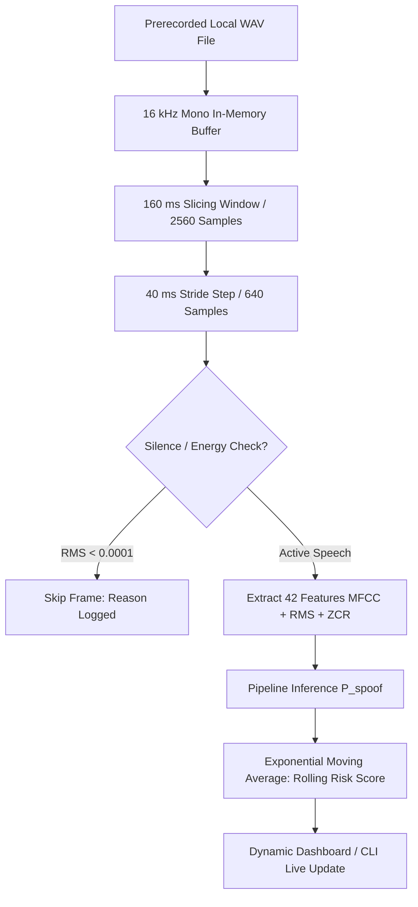

# 📡 VoiceShield Sandbox Streaming Simulation Protocol

> **Statutory Notice**:
> *SANDBOX SIMULATION — NOT A LIVE CALL.*
> *This simulation demonstrates the processing flow only. It is not a telecom integration or production latency benchmark.*

---

## 1. Streaming Simulation Concept & Goal

In a real-time call center or Security Operations Center (SOC), voice deepfake detection cannot wait until a 30-minute call finishes. An analytical system must inspect incoming audio **frame by frame** and update a rolling risk score as the speaker talks.

The **VoiceShield Sandbox Simulator** takes a local prerecorded WAV file and mimics the streaming ingestion pipeline in volatile memory.

---

## 2. Ingestion & Analysis Architecture



---

## 3. Key Parameters & Rationale

| Parameter | Default Value | Technical Rationale |
| :--- | :--- | :--- |
| **Window Size** | `160 ms` ($2560\text{ samples}$) | Captures short-time stationary phonemes and formant resonance without incurring heavy spectral lag. |
| **Stride Step** | `40 ms` ($640\text{ samples}$) | Provides $75\%$ overlap ($120\text{ ms}$ shared) ensuring smooth temporal continuity across phoneme transitions. |
| **Sampling Rate** | `16,000 Hz` | Standard wideband acoustic analysis rate covering frequencies up to $8\text{ kHz}$. |
| **Smoothing Factor ($\alpha$)** | `0.20` | Weight assigned to current frame vs historical score in Exponential Moving Average ($S_t = \alpha I_t + (1-\alpha) S_{t-1}$). |
| **Silence RMS Threshold** | `0.0001` | Filters out background silence and pause periods between speech phrases. |

---

## 4. Why This is NOT a True Live-Call Integration

1. **Local Prerecorded File**: Audio is read from disk into an in-memory buffer, rather than received over a telecom network interface.
2. **Zero SIP / RTP Hooks**: The simulator does not intercept VoIP packets, SIP signalling, or PBX media streams.
3. **No Network Latency Simulation**: Inter-chunk delays are synthetic software timers and do not account for variable telecom packet jitter, packet loss, or cellular bandwidth throttling.
4. **Advisory Decision Support Only**: System computes advisory risk scores and never sends call drop commands or initiates automated account actions.

---

## 5. Execution Commands

### Run from Terminal:
```powershell
python scripts/simulate_stream.py --audio data/test/ai_voice/1.wav --max-windows 30
```

### Run in Streamlit SOC Dashboard:
Open [http://localhost:8502](http://localhost:8502), navigate to **Tab 4 (📡 Live Call Streaming Simulator)**, and click **▶️ Start Live Stream Simulation**.
